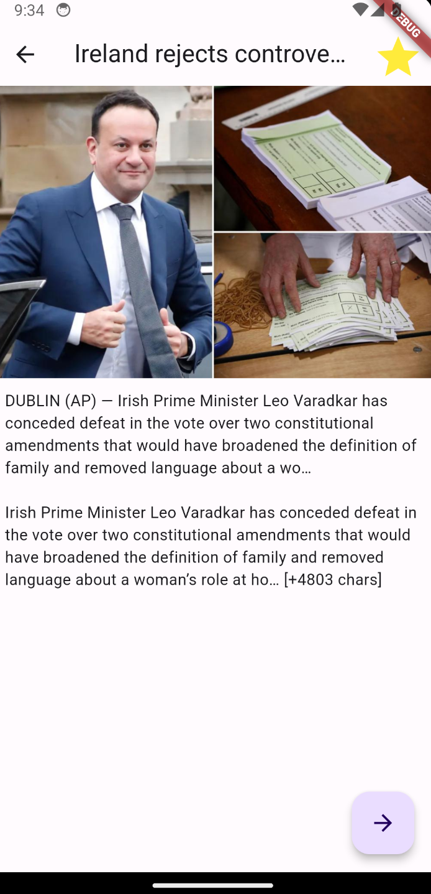
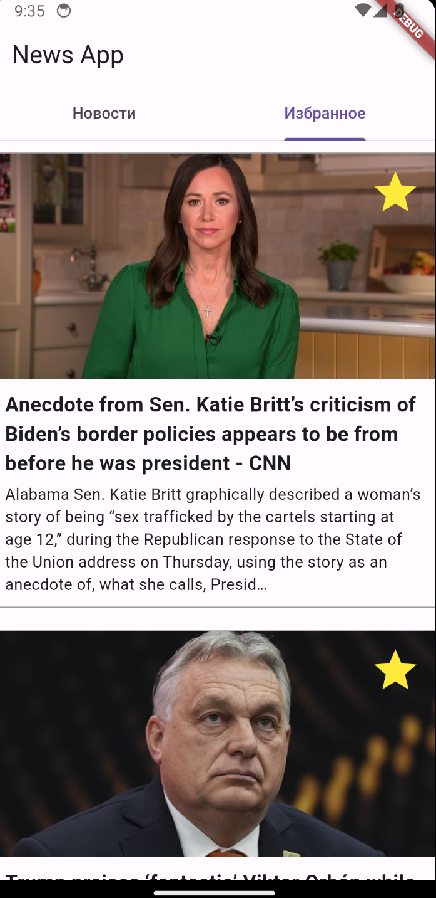

## Домашняя работа 2 по Flutter
#### Хамид Карим БПИ214

---
### Описание проделаной работы
Разработку проводил на Google Pixel 3a. Пакеты используют "hw1", но я не думаю что это критично, я просто использую код, написанный в дз 1 и переименовывать проект не вижу смысла(надеюсь, это не наказуемо🙃).

Реализовано сохранение  избранное при нажатии на иконку звездочки. При повторном нажатии, запись удаляется из избранного. Данное сохранение происходит и в `SharedPreferences`, что дает возможность не терять данные при перезаходах в приложение(Хотя это я вообще не понимаю, ведь всегда используется backend для сохранения и подгрузки. Можно говорить про кеширование конечно, но кеширование происходит со стороны сервера для корректного отображения информации, а кеш в приложении скорее всего будет отображать недостоверную информацию).

Также, можно перейти на страницу с избранным и просматривать детально, просматривать избранные и удалять из избранных новости.

Команда `dart format --output=none --set-exit-if-changed .` не изменяет ни одного файла, значит все проходит и она не выдает проблем.

Написал два Unit-теста для двух ключевых действий в приложении. Также, написал два ключевых для бизнес логики теста на виджет.

Создал APK файл, который лежит в корне проекта под названием `app-release.apk`.

---
### Запуск
Для того, чтобы запустить проект, нужно по `.env.example` сделать .env файл в корне и прописать свой api ключ.

--- 
### Скриншоты
#### Главная страница с лентой новостей, в которой можно проставить избранное новости.

#### Так же работает и внутри detail страницы:

#### Можно посмотреть избранные новости и прямо отсюда их и удалить, если они больше не нужны. Элемент новости сам удалится из избранного. Отсюда также работает Detail экран для каждой новости, так как это один и тот же виджет как и в главной ленте.
